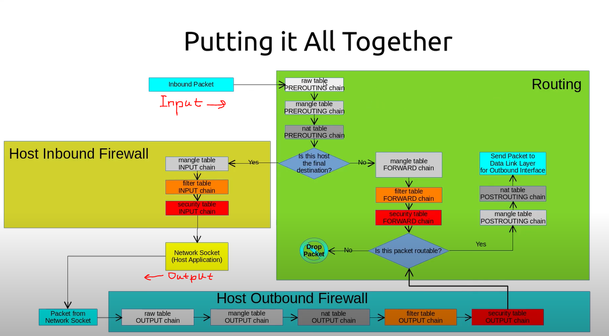
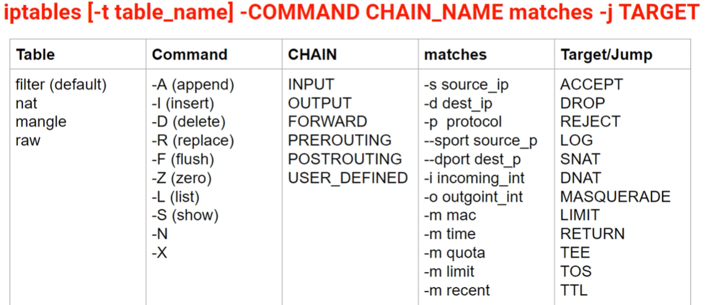
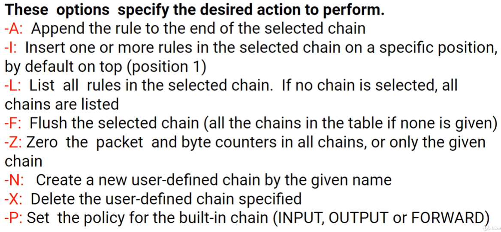

# iptables-reference

## Topics
[Reference](doc/Reference.md)  
[Examples](doc/Examples.md)  


</br>  

## Rules persistency

Rules that are written in the terminal, are lost after system restart.  

For more info, please refer the "Rules persistency" chapter in 
[Reference](doc/Reference.md).


</br>  

## High Level Scheme

Graph taken from [here](https://www.youtube.com/watch?v=yE82upHCxfU).  




</br>  

## Quick Reference

`iptables` command structure:
  

`iptables` commands:
  


</br>  

## Command examples

### List

If `-n` flag is used, the numeric values will be printed.   
For example, ssh port will be printed as 22.  
This prevents alot on DNS lookups.

List `filter` table (`filter` is the default table).  
(nv for numeric and verbose)
``` 
sudo iptables -nvL
```

List specific table (nat in this example).  
(nv for numeric and verbose)  

``` 
sudo iptables -nvL -t nat
```

### Flush (remove) 

Remove all rules from all chains (of the default `filter` table).  
```
sudo iptables -F
```

Remove all rules from input chain (of the default `filter` table).  
```
sudo iptables -F INPUT
```

### Default policy definition

Each packet that doesn't maches any rule will have the default policy.  
In the example below, all the packets in FARWARD chain will be dropped.  
```
sudo iptables -P FARWARD DROP
```
