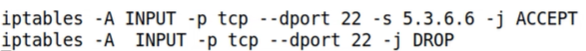
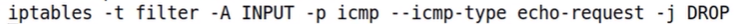
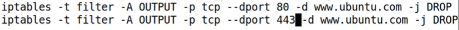

## Examples

### Block port 22

In the example from above two rules are defined:   
1. Accept traffic from port 22 from ip 5.3.6.6.  
2. Block all traffic from port 22.  

Note that each INPUT packet will go rule by rule until it matches on of the rules.   
This way, we allow traffic on port 22 only if it comes from source ip 5.3.6.6.

   

### Block incoming pings

The example above, blocks the ICMP echo-request packets that ping utility is using.  

   

### Block `www.ubuntu.com`

The example above, blocks access to `www.ubuntu.com`.  
Note that we have to block both http port (80) and https (443).  

