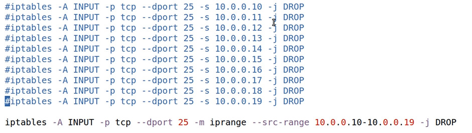
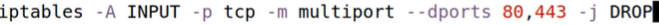

# Iptables reference

## Notes

* Each iptables rule is placed in specific `chain` in specific `table`.  

* `target` is the action that is performed on the packet when packet matches a rule.


</br>

## Rules persistency


</br>

## Definitions

There are 5 predifined chains types.


iptabled table types:


Default policies:


Default policies are shown in list command:


</br>


## IP ranges

We can apply rules on IP address ranges.  
The example below blocks 10 IP addresses with a single rule:   




</br>

## Multiple ports

Multiport rules are available in iptables:



</br>

## Negating Matches (NOT)

Dropping all incoming ssh traffic accepting packets from 100.0.0.1 :
``` 
iptables -A INPUT -p tcp --dport 22 ! -s 100.0.0.1 -j DROP
```

Dropping all outgoing https traffic excepting to `www.linux.com`:
 ```
iptables -A OUTPUT -p tcp --dport 443 ! -d www.linux.com -j DROP
 ```
 
 ## TCP flags rules

Dropping all incoming tcp packets that have syn set:  
 ```
iptables -A INPUT -p tcp --syn -j DROP
 ```

Logging outgoing traffic that has syn and ack set
 ```
iptables -A OUTPUT -p tcp --tcp-flags syn,ack,rst,fin syn,ack -j LOG
 ```