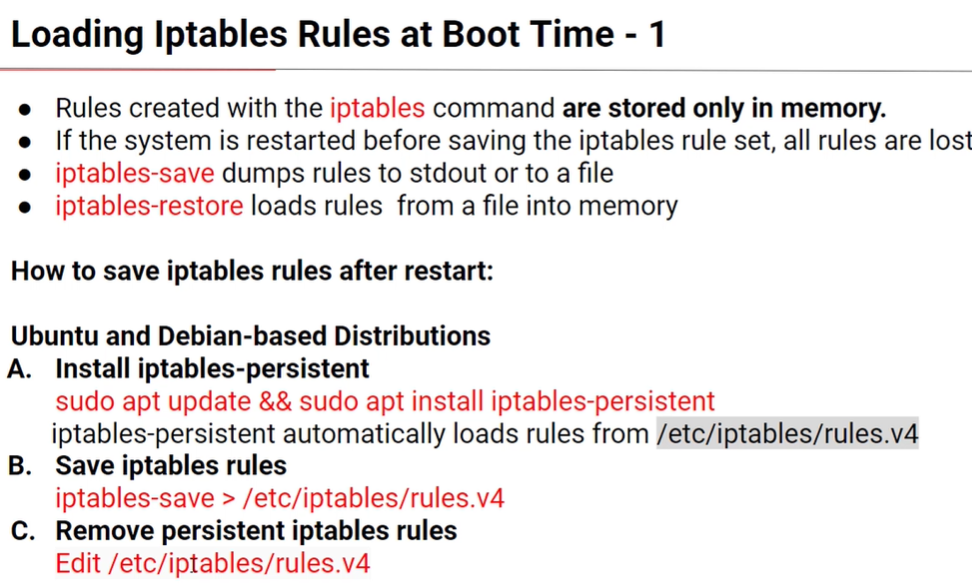
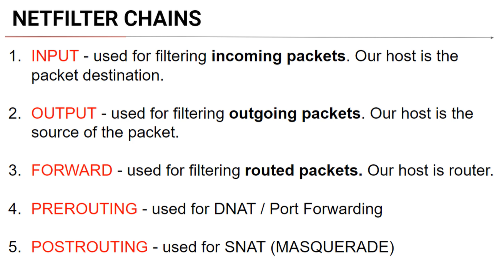
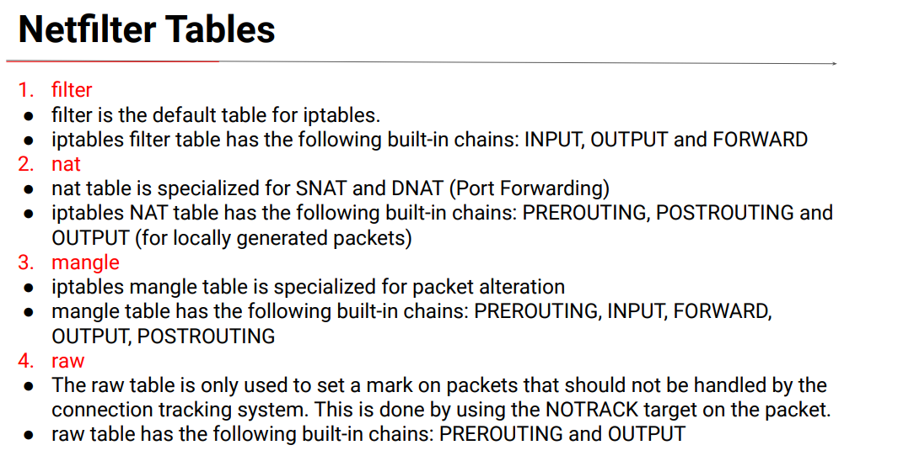
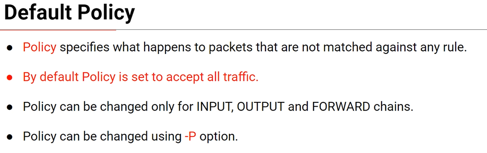
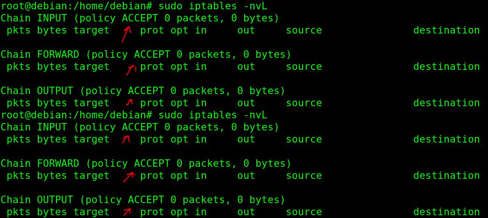

# Iptables reference

## Notes

* Each iptables rule is placed in specific `chain` in specific `table`.  

* `target` is the action that is performed on the packet when packet matches a rule.

 

## Rules persistency

 

## Definitions

There are 5 predifined chains types.

iptabled table types:

Default policies:

Default policies are shown in list command:

 

